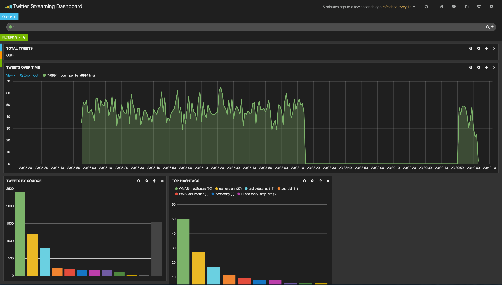

Twitter Streaming API Learning
==============================

Repo that sets up twitter stream api readers. Uses
Docker containers!

The plan is to use:

* RabbitMQ for a message queue
* Python to read twitter stream data
* Python to parse relevant twitter data
 * Tweets with links
 * Tweets with hashtags
 * Tweets emoji
* Logstash to do data aggregation and graphing

Requirements:
-------------

* Docker 0.11.1
* Fig 0.4.1

This project was created using these versions. It may
work with newer versions. I'll upgrade when I get a chance.

Running
-------

Once `docker` and `fig` are installed and configured:

```bash
$ fig up -d rabbit
```

Navigate to `http://localhost:8888` to view the running
rabbitmq instance.

```bash
$ fig up -d twitter
```

On the rabbitmq [webpage](http://localhost:15672), view the messages per second.

To start viewing the messages, we first need to start the logstash container:

```bash
$ fig up -d logstash
```

You can view the processed messages by navigating to the logstash [webpage](http://localhost:9292/index.html#/dashboard/file/logstash.json)

Now start the workers that process the rabbitmq messages:

```bash
$ fig up worker
```

If you refresh the logstash page, you should see lots of messages.

Logstash Dashboard
------------------

Want a cool preset dashboard of the data? On the logstash dashboard, click _load_, _advanced_, and type `00d5d08deb7a46107772`
in the gist number field. The dashboard will be similar to



Optional scaling:
-----------------

Scaling the twitter streaming reader container is easy:

```bash
$ fig scale twitter=4
```

You can also scale the workers:

```bash
$ fig scale worker=4
```

Watch the messages per second rise!

Tests:
------

To run the tests just:

```bash
$ make test
```

Roadmap
-------

 - [x] Pipe Twitter stream to a message queue (`fig up -d twitter`)
 - [x] Pull from queue and parse data (`fig up worker`)
 - [ ] Extract interesting info, like emoji data, hashtags, links, etc
 - [ ] Graph live data
 - [ ] Multi-host container support
